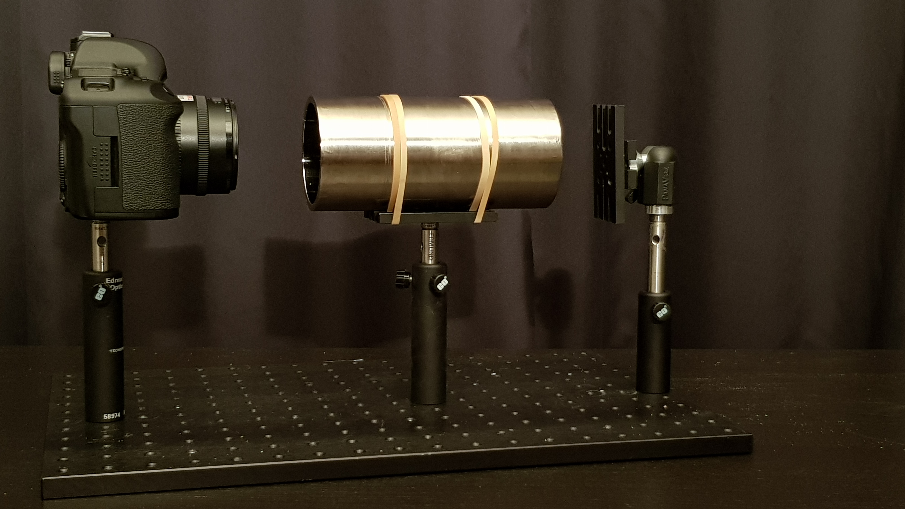
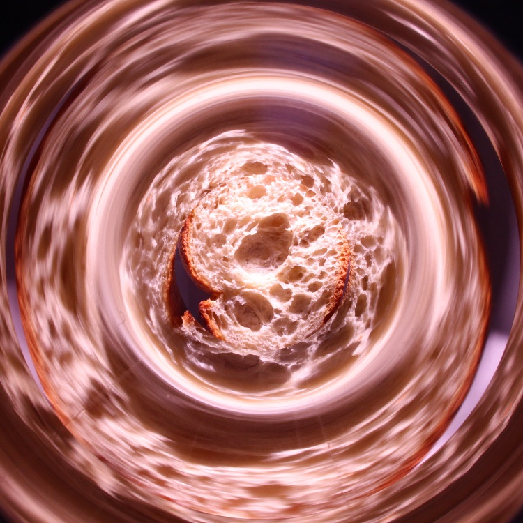

# Reconstruction of 3D Objects with Radial Imaging

Daniel Filipe Nunes Silva, EPFL

## Description
This project is inspired by the following paper [Multiview Radial Catadioptric Imaging for Scene Capture](http://www.cs.columbia.edu/cg/pdfs/1156187429-Kuthirummal_TOG06.pdf).

The goal of this project is to generate the 3D structure of objects from one single image combining directly captured and reflected rays (on the inside of a mirrored hollow cylinder). We use this setup to capture images.

A slice of bread imaged with this setup by the camera looking through the cylinder :

After executing the pipeline we get this result for the corresponding slice of bread visualized with PPTK (blue=close, red=far). Since this system captures multiple viewpoint we can reconstruct the object with left-central and central-right views pairs.

## Pipeline

1. Separate the views
2. Do stereo matching
3. Do triangulation
4. Recover the initial shape

## Dependencies
This project has been tested on linux with :
- Python 3.6
- Numpy 1.15
- Matplotlib 3.0
- [OpenCV 4.0](https://pypi.org/project/opencv-python/)
- [PPTK](https://github.com/heremaps/pptk)

## Quickstart
Two downsampled images are provided.

Generate 3D point clouds (Disparity maps are plotted during the process) :

Execute `python3 exe.py` in _prototype_ directory

Visualize 3D point cloud using PPTK :

`python3 display_points.py bread01`

or

`python3 display_points.py bread02`

## More details
More details could be found in [the report related to this project.](report/Reconstruction of 3D objects with radial imaging.pdf)
